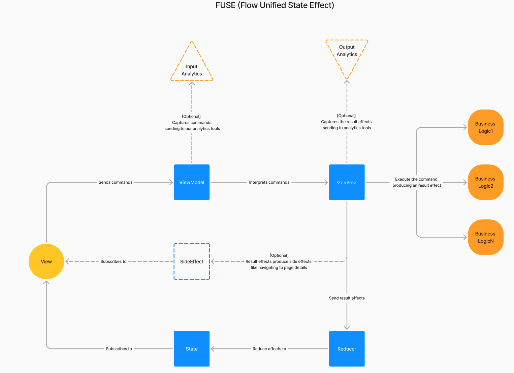

# CSTV — CS:GO Leagues (Android)

Android app for browsing CS:GO matches from the PandaScore API.

## Stack

- Kotlin + Jetpack Compose
- Koin for DI
- Ktor + Kotlin Serialization for networking
- Coil 3 for image loading
- NDK/JNI for API token access
- Custom FUSE-style state/effect architecture

## Screens

- Splash
- Matches list with pull-to-refresh and pagination
- Match detail with per-team player loading

## Architecture

The app is split into shared infrastructure plus feature packages.

Architecture diagram:



### Shared layers

- `com.voidx.csgo.core`
  - base architecture classes
  - coroutine dispatchers
  - theme/design system
  - JNI secret bridge
- `com.voidx.csgo.data`
  - DTOs
  - mappers
  - Ktor API service
  - repository implementations
- `com.voidx.csgo.domain`
  - shared entities
- `com.voidx.csgo.navigation`
  - app-level nav host
  - `MatchNavType`

### Feature layout

Each feature owns its navigation, DI module, business logic, presentation state, and UI.

```text
feature/<feature-name>/
├── <Feature>Module.kt
├── <Feature>Navigation.kt
├── business/
├── presentation/
└── ui/
```

Implemented features:

- `feature/splash`
- `feature/matches`
- `feature/matchdetail`

### App composition root

The app starts Koin in [App.kt](/Users/victor/Documents/Workspace/soccer-league/csgo-leagues-android/app/src/main/java/com/voidx/csgo/App.kt) and assembles modules in [AppModules.kt](/Users/victor/Documents/Workspace/soccer-league/csgo-leagues-android/app/src/main/java/com/voidx/csgo/AppModules.kt):

- `coroutineDispatchersModule`
- `networkModule(...)`
- `repositoryModule`
- `splashModule`
- `matchesModule`
- `matchDetailModule`

## State flow

The UI uses a FUSE-style flow:

```text
UI -> Command -> ViewModel.dispatch()
   -> Interactor(state, command) -> Flow<Effect>
   -> Reducer(effect) -> new State
   -> UI renders State

Optional one-shot events:
Interactor -> SideEffect -> UI
```

## Secret management

The PandaScore token is loaded through JNI, not `BuildConfig`.

Setup flow:

```text
.env
  -> scripts/generate_secrets.py --platform android
  -> app/src/main/cpp/secrets.cpp
  -> CMake / native library
  -> Secrets.getApiToken()
  -> Ktor bearer auth
```

Requirements:

- root `.env` must contain `PANDASCORE_TOKEN=...`
- generated `app/src/main/cpp/secrets.cpp` is git-ignored
- Android build expects the native secrets pipeline to be available

## Setup

### Prerequisites

- Android Studio
- JDK 17
- Android SDK 26+
- Android NDK

### Local setup

1. Create the root `.env` file if it does not exist:

```bash
PANDASCORE_TOKEN=your_token_here
```

2. Generate Android native secrets:

```bash
python3 scripts/generate_secrets.py --platform android
```

3. Open `csgo-leagues-android/` in Android Studio or use Gradle from the CLI.

## Commands

From `csgo-leagues-android/`:

```bash
./gradlew :app:compileDebugKotlin
./gradlew :app:assembleDebug
./gradlew :app:testDebugUnitTest
```

## Notes

- `collectAsStateWithLifecycle()` is used for screen state collection.
- Feature-level errors stay typed in presentation state/effects; Android string resolution happens in the screen layer.
- Matches and players use PandaScore thumbnail URLs, matching the iOS behavior.
- The system splash screen is kept, and the branded Compose splash is always shown after launch.
